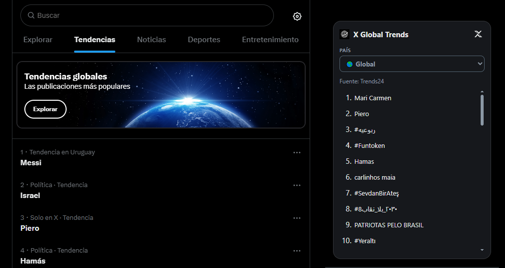
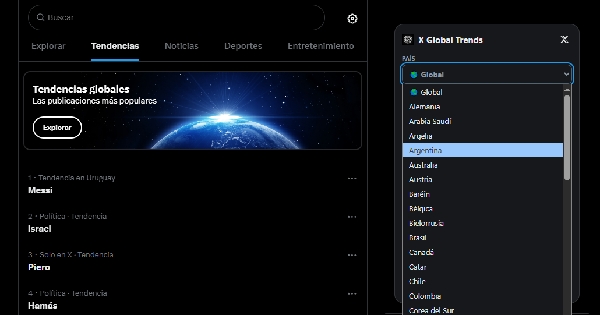
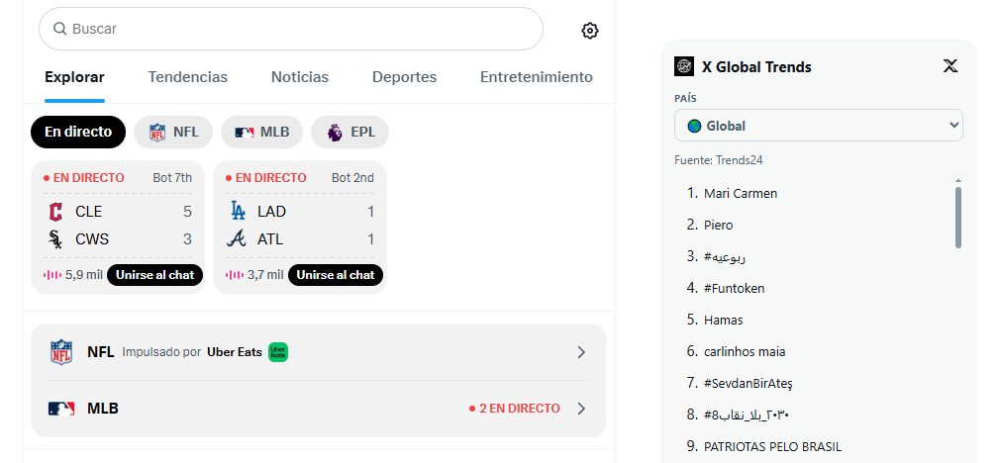

<div align="center">
  

# X Global Trends

**Tendencias globales y por país, integradas directamente en X.**


</div>

X Global Trends es una extensión para Chrome y Brave que añade un panel compacto de tendencias a la barra lateral de X. Permite consultar **Global** y los países publicados por Trends24 sin salir de `x.com`.

> **Estado actual:** `0.9.0` es una Release Candidate aprobada. La distribución se realiza por ahora desde este repositorio; la publicación en Chrome Web Store está pausada.

## ✨ Características

- 🌎 Tendencias **Global** y por país.
- 🌐 Países descubiertos dinámicamente desde Trends24.
- 🇪🇸 Nombres de países mostrados en español.
- 🧩 Integración nativa en la sidebar de X en `/home`, `/explore` y `/explore/*`.
- 💾 Persistencia automática del último país seleccionado.
- ⚡ Caché local de 7 minutos para reducir solicitudes innecesarias.
- 🧹 Deduplicación de tendencias repetidas.
- 🔄 Protección frente a respuestas de red fuera de orden.
- 🔗 Las tendencias se abren en una pestaña nueva de X.
- 🌗 Adaptación a modo claro y oscuro.
- 🧭 Compatibilidad con la navegación SPA de X sin duplicar el panel.
- 🔒 Sin cookies de X, `auth_token`, `ct0`, API keys, analytics ni servidor propio.

## 📸 Cómo funciona

El panel aparece en la barra lateral derecha de X y conserva la navegación normal de la plataforma.

<p align="center">
  
  
</p>
<p align="center">
  <sub>Modo oscuro · Global</sub>&nbsp;&nbsp;&nbsp;&nbsp;<sub>Selector de países</sub>
</p>

<p align="center">
  
</p>
<p align="center"><sub>Modo claro</sub></p>

1. Elegí **Global** o un país en el selector **PAÍS**.
2. La extensión consulta la fuente pública configurada.
3. Se muestran las tendencias disponibles en orden.
4. Al seleccionar una tendencia, se abre su búsqueda en X en una pestaña nueva.
5. El último país queda guardado localmente para la próxima sesión.

## 🚀 Instalación manual

1. Descargá [X-Global-Trends-0.9.0.zip](dist/X-Global-Trends-0.9.0.zip) y descomprimilo en una carpeta que vayas a conservar. El archivo `manifest.json` debe quedar directamente dentro de esa carpeta.
2. Abrí `chrome://extensions` en Chrome o `brave://extensions` en Brave.
3. Activá **Modo de desarrollador** y elegí **Cargar descomprimida**.
4. Seleccioná la carpeta que contiene `manifest.json`.
5. Abrí `https://x.com/home` o `https://x.com/explore`.

Para actualizar una instalación manual, reemplazá el contenido de esa carpeta con el de un nuevo ZIP y pulsá **Recargar** en la tarjeta de la extensión.

## 🛡️ Verificación de seguridad

El paquete oficial `X-Global-Trends-0.9.0.zip` tiene el siguiente SHA-256:

```text
8694766691c58d7f6ef0385ac5cdf402dba6cba192ac8ac56b3373d19a05c9ad
```

El archivo distribuido fue verificado byte a byte contra el código fuente distribuible de este repositorio. Un análisis de [VirusTotal](https://www.virustotal.com/gui/file/8694766691c58d7f6ef0385ac5cdf402dba6cba192ac8ac56b3373d19a05c9ad) reportó **0/65 detecciones** para este ZIP. Esta información es una verificación puntual y no sustituye la evaluación de seguridad de cada persona usuaria.

Malwarebytes Browser Guard mostró una detección **“Riskware”** sobre la URL de descarga. Está en revisión como posible falso positivo; no se afirma que la detección haya sido corregida ni se desaconseja el uso de herramientas de seguridad.

## 🔐 Privacidad

La extensión está diseñada con una superficie de datos mínima:

- no recopila datos personales;
- no lee ni almacena cookies de X;
- no usa tokens de autenticación de X;
- no lee mensajes privados;
- no publica contenido;
- no usa analytics;
- no envía datos a un servidor propio.

`chrome.storage.local` se utiliza únicamente para:

- caché temporal de respuestas de Trends24;
- recordar la última ubicación seleccionada.

La política completa está disponible en [PRIVACY.md](PRIVACY.md).

## 🔑 Permisos

| Permiso / acceso | Motivo |
|---|---|
| `storage` | Caché local y persistencia del último país. |
| `https://trends24.in/*` | Consultar páginas públicas del proveedor de tendencias. |
| `https://x.com/*` | Insertar la interfaz de X Global Trends dentro de X. |
| `assets/icons/icon-32.png` como recurso web accesible | Mostrar el icono oficial dentro del panel integrado en X. |

No se solicitan permisos adicionales para historial, pestañas, cookies, identidad o datos de cuenta.

## 📡 Fuente de datos

El proveedor actual es **Trends24**. X Global Trends no calcula un ranking propio: muestra y procesa los datos públicamente disponibles a través del proveedor.

X Global Trends es un proyecto independiente y **no está afiliado, patrocinado ni respaldado por X ni por Trends24**.

## ⚠️ Limitaciones actuales

- La cobertura geográfica depende de las ubicaciones publicadas por Trends24.
- Uruguay no está disponible actualmente como ubicación propia en el proveedor.
- Noticias, Deportes y Entretenimiento no se muestran porque todavía no existe una fuente pública que permita combinarlas de forma fiable con el país elegido respetando los requisitos actuales de privacidad y coste.
- Cambios en el HTML de X o Trends24 pueden requerir ajustes futuros en la extensión.

## 💎 Filosofía Freemium

El objetivo es mantener un **núcleo gratuito útil y respetuoso con la privacidad**. Funciones premium futuras solo se evaluarían si aportan valor adicional real; la versión gratuita no se convertirá artificialmente en una demo inutilizable.

Hoy `0.9.0` no contiene funciones de pago ni sistema de cobros.

## 🗺️ Roadmap

El detalle actualizado está en [ROADMAP.md](ROADMAP.md). Prioridades posteriores a `0.9.0`:

- ampliar cobertura geográfica si aparece una fuente compatible;
- investigar categorías reales sin depender de credenciales privadas;
- favoritos y preferencias adicionales;
- retomar la distribución en Chrome Web Store si se decide más adelante;
- definir, más adelante, funciones opcionales para una capa Pro.

## 🧪 Release y calidad

La lista de validaciones para la release candidate está documentada en [RELEASE_CHECKLIST.md](RELEASE_CHECKLIST.md).

Los cambios relevantes por versión se registran en [CHANGELOG.md](CHANGELOG.md).

## ⚖️ Licencia y nombre

El código fuente de X Global Trends se distribuye bajo la [Mozilla Public License 2.0](LICENSE) (`MPL-2.0`). El texto completo de la licencia está en `LICENSE`.

> This Source Code Form is subject to the terms of the Mozilla Public License, v. 2.0. If a copy of the MPL was not distributed with this file, You can obtain one at https://mozilla.org/MPL/2.0/.

La MPL-2.0 no concede derechos sobre marcas o logotipos. La disponibilidad del código y de los archivos del proyecto no implica que un proyecto derivado sea la versión oficial de X Global Trends ni que esté respaldado por su autor.

## 🗂️ Estructura

```text
X-Global-Trends/
├─ assets/icons/        # Iconos oficiales
├─ src/
│  ├─ providers/        # Proveedores de tendencias
│  ├─ background.js     # Fetch y caché
│  ├─ content.js        # Integración con X / SPA
│  ├─ trends.js         # Localización de países
│  └─ ui.js             # Render del panel
├─ styles/trends.css    # Estilos del panel
├─ manifest.json        # Manifest V3
├─ dist/                # ZIP instalable 0.9.0
├─ LICENSE              # MPL-2.0
├─ PRIVACY.md
├─ ROADMAP.md
├─ RELEASE_CHECKLIST.md
└─ CHANGELOG.md
```

## 👤 Autor

**Nico Aguilar**  
X: https://x.com/NicoAguilarUY

---

<div align="center">
  <strong>X Global Trends · 0.9.0</strong><br>
  Hecho para consultar el mundo sin salir de X.
</div>
